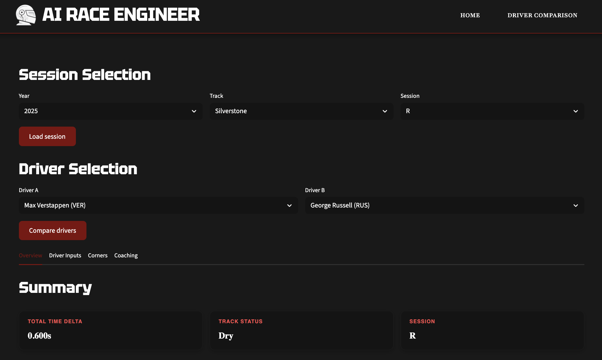
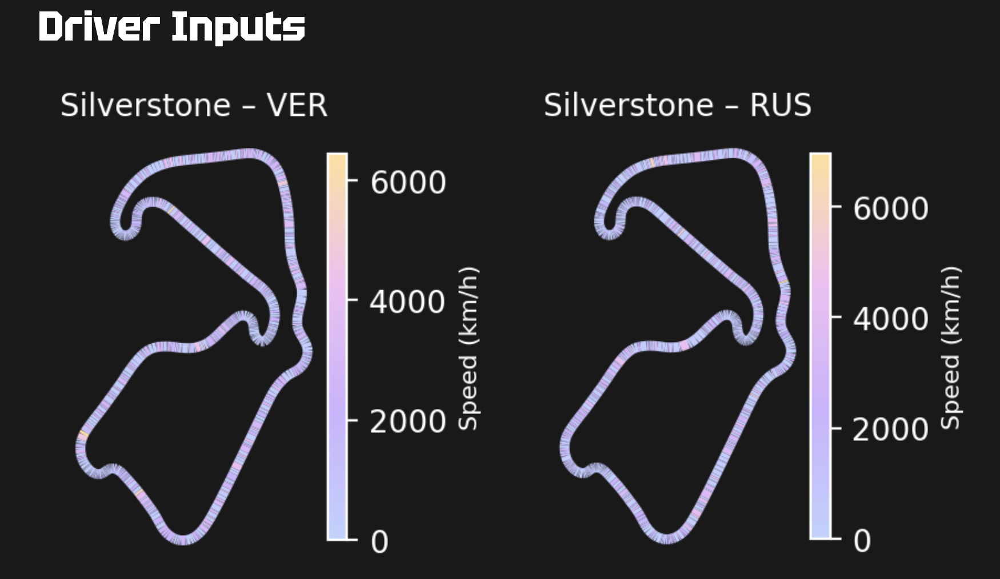
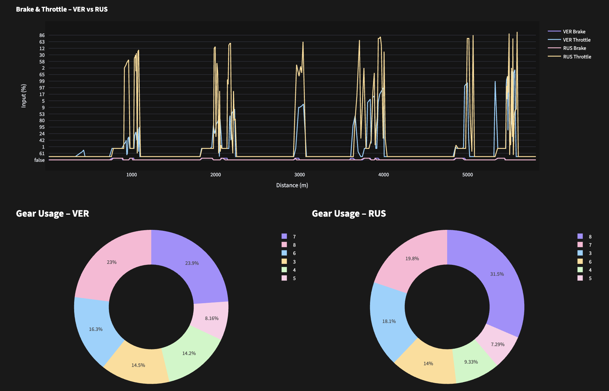
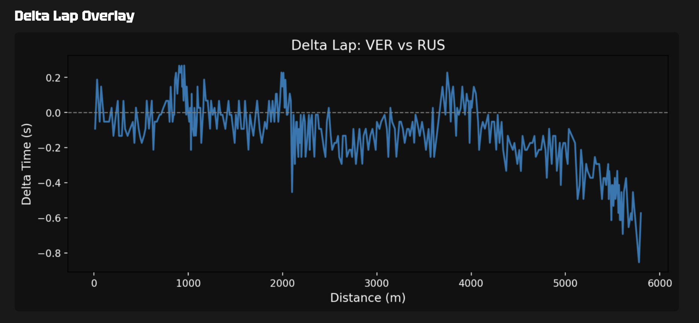

# AI Race Engineer

[](https://github.com/Sissighn/ai-race-engineer/actions/workflows/ci.yml)


AI Race Engineer is a Formula 1 telemetry analysis platform that simulates the workflow of a race/performance engineer. It transforms raw telemetry into corner-level insights, time-loss diagnostics, driver-style profiling, and actionable coaching recommendations.



## Current Project Status

This repository now includes:

- Centralized structured logging (`structlog`)
- Standardized domain exceptions and UI-friendly error mapping
- Environment-based configuration (`.env` + settings module)
- Type hints across core modules
- Pydantic schemas for validated payloads
- Automated test suite (`pytest` + `pytest-cov`)
- CI pipeline with GitHub Actions

---

## Key Features

### Telemetry & Performance Analysis

- Corner segmentation and corner-level delta analytics
- Time loss estimation per corner
- Delta lap comparison between two drivers
- Speed, throttle, brake, gear, and track map visualizations

The assumptions and validation approach behind the time-loss model are
documented in [docs/methodology.md](docs/methodology.md).





### Coaching & Reporting

- Rule-based driving coaching suggestions
- Driver DNA profiling (aggressiveness, smoothness, etc.)
- Executive race engineer summary report

### Session Management

- FastF1 schedule/session integration
- Dynamic track loading by season
- Local caching support for faster repeated analysis

---

## Tech Stack

- **Language:** Python 3.11 or 3.12
- **App Framework:** Streamlit
- **Data Source:** FastF1
- **Data/Math:** Pandas, NumPy, SciPy
- **Visualization:** Plotly, Matplotlib
- **Validation:** Pydantic
- **Logging:** structlog
- **Testing:** pytest, pytest-cov

---

## Project Structure

```bash
ai-race-engineer/
├── .github/workflows/      # CI pipeline (GitHub Actions)
├── app/                    # UI layer (Streamlit pages/components)
│   ├── assets/
│   ├── components/
│   ├── pages/
│   ├── utils/
│   └── main.py
├── src/                    # Core logic layer
│   ├── application/        # Use-case orchestration services
│   ├── domain/             # Domain analysis/reporting logic
│   ├── infrastructure/     # External adapters (FastF1)
│   ├── config/             # Settings management
│   ├── data/               # Data loading and preprocessing
│   ├── logging/            # Logging bootstrap/config
│   ├── models/             # Pydantic schemas
│   └── exceptions.py       # Domain exception hierarchy
├── tests/                  # Unit tests
├── cache/
├── data/
├── notebooks/
├── requirements.txt
├── pytest.ini
└── README.md
```

---

## Architecture (Current)

The codebase follows a layered structure:

- `app` → Streamlit UI only (rendering, interaction, UI caching)
- `src/application` → use-case orchestration between UI and domain
- `src/domain` → core analysis/reporting logic
- `src/infrastructure` → external adapters (FastF1 integration)
- `src/data` → telemetry/session data shaping utilities

Request flow is:

`UI (app)` → `Application services` → `Domain logic` (+ `Infrastructure/Data` as needed)

This separation keeps business logic testable and avoids coupling Streamlit with core computations.

### Import Guidelines

- New analysis/reporting code should be added under `src/domain/*`.
- UI pages/components should call application services from `src/application/*`.
- Avoid adding direct Streamlit dependencies in `src/domain`, `src/data`, or `src/infrastructure`.

---

## Getting Started

### 1) Clone

```bash
git clone https://github.com/Sissighn/ai-race-engineer.git
cd ai-race-engineer
```

### 2) Create and activate virtual environment

Use Python 3.11 or 3.12. The repository includes `.python-version` for tools
such as `pyenv`; CI tests both supported versions.

```bash
python3.11 -m venv venv
# macOS/Linux
source venv/bin/activate
# Windows (PowerShell)
venv\Scripts\Activate.ps1
```

### 3) Install dependencies for development

```bash
python -m pip install --upgrade pip
pip install -r requirements-dev.txt
```

For runtime-only installs, use:

```bash
pip install -r requirements.txt
```

`pyproject.toml` is the dependency source of truth. `requirements.txt` and
`requirements-dev.txt` are thin compatibility entry points for pip-based
environments.

### 4) Run the app

```bash
streamlit run app/main.py
```

### Docker

Build and run the production-style Streamlit container:

```bash
docker build -t ai-race-engineer .
docker run --rm -p 8501:8501 ai-race-engineer
```

Then open `http://localhost:8501`.

For repeated local runs with a persistent FastF1 cache:

```bash
docker compose up --build
```

---

## Testing

Run tests:

```bash
pytest
```

Run tests with coverage:

```bash
pytest --cov=src --cov=app/components --cov-report=term-missing
```

---

## CI/CD (GitHub Actions)

The CI workflow is defined in [.github/workflows/ci.yml](.github/workflows/ci.yml).

It currently performs:

1. Dependency installation
2. Import smoke-check
3. Test execution with coverage and a minimum threshold

Pipeline triggers on pushes and pull requests to `main`.

---

## Configuration

Use environment variables for runtime behavior. See [.env.example](.env.example) if present.

Important settings include:

- `ENVIRONMENT`
- `LOG_LEVEL`
- `FASTF1_CACHE_ENABLED`
- `FASTF1_REQUEST_TIMEOUT`
- `SESSION_CACHE_TTL`
- `TELEMETRY_CACHE_TTL`

---

## License

MIT License © 2026 Setayesh Golshan

This project is unofficial and is not associated with Formula 1. F1, FORMULA ONE, FORMULA 1, FIA FORMULA ONE WORLD CHAMPIONSHIP, GRAND PRIX, and related marks are trademarks of Formula One Licensing B.V.
